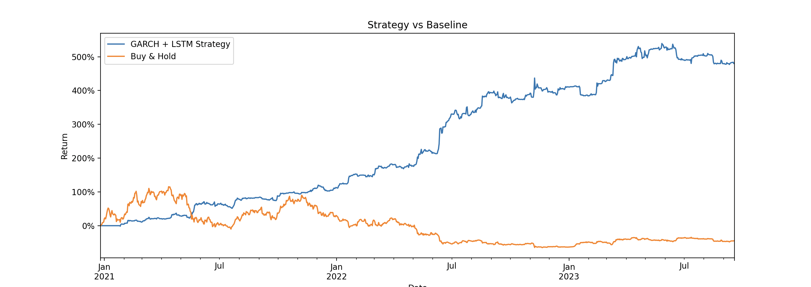
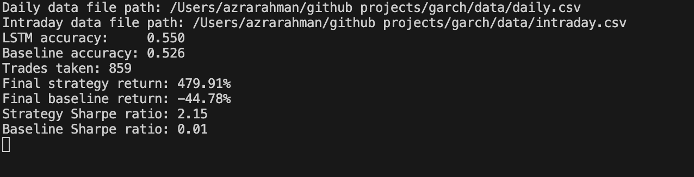
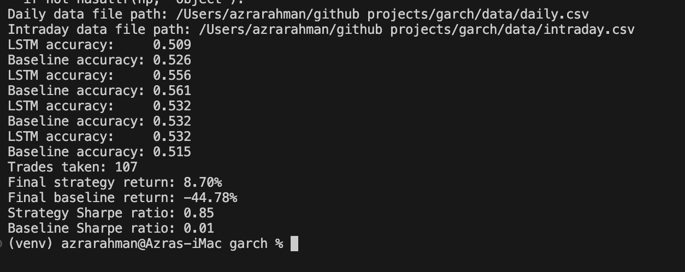

# Intraday Volatility Trading Strategy using GARCH + LSTM

## Overview
This project implements a hybrid volatility-driven trading strategy combining classical econometric modelling (GARCH) with machine learning (LSTM). The goal is to generate a risk-adjusted, systematic trading strategy for daily returns.

## Data
- **Daily adjusted returns:** `/data/daily.csv`
- **Intraday returns:** `/data/intraday.csv`

## Methodology

### GARCH modelling
- Estimates daily volatility regimes (high/low volatility).
- Provides a baseline directional signal.

### LSTM neural network
- **Inputs:** log returns + lagged returns + rolling volatility + momentum ratios.
- **Target:** directional returns (up/down) or optionally large-move days.
- Small LSTM (32 units) trained with early stopping to prevent overfitting.
- Walk-forward validation: rolling windows retrain the model and predict future periods.

### Signal construction
- LSTM probability weighted signals: `(lstm_prob - 0.5) * 2`
- Threshold applied to trade only high-confidence predictions (default 0.53)
- Optional scaling by GARCH volatility regime.
- Shifted by 1 day to simulate realistic execution.

## Backtesting & evaluation
- Strategy returns vs baseline (buy-and-hold) computed.
- Sharpe ratio calculated for risk-adjusted performance.
- Cumulative returns plotted for visual comparison.

## Results (example)
- **Trades taken:** 859
- **Strategy return:** 479.91%
- **Baseline return:** -44.78%
- **Strategy Sharpe:** 2.15
- **Baseline Sharpe:** 0.01

## Insights
- LSTM accuracy does not need to vastly exceed baseline to generate strong risk-adjusted returns.
- Walk-forward validation ensures robustness and reduces overfitting.
- Probability thresholding and momentum/volatility features significantly improve performance.

## Future Work
- Integrate true GARCH volatility regimes for dynamic position sizing.
- Test on multiple instruments and market periods to confirm generalisation.
- Explore multi-class targets (e.g., large gain / large loss / flat day) for improved signal filtering.

Results: 

After overfitting prevention:

## Walk-Forward Validation

The LSTM is trained on a rolling historical window and only predicts the next test window.

This ensures the model never sees future returns when making predictions.

By retraining on each new window, the model adapts to changing market conditions rather than memorising past noise.

## Early Stopping

During training, the LSTM stops if validation loss stops improving, restoring the best weights.

Prevents the network from overfitting small fluctuations in the training data.

## Probability Thresholding (Confidence Filtering)

Only trades with sufficiently high predicted probability are executed.

Avoids making trades on low-confidence signals, reducing noise-driven losses.

## Small, Controlled Network Architecture

LSTM uses 32 units, keeping the model simple enough to learn patterns without memorising every tiny variation.

## Limited Feature Set

Only carefully engineered features (lagged returns, rolling volatility, momentum ratios) are used.

Avoids overfitting from too many irrelevant variables.

## Next-Day Execution

All signals are shifted by one day to prevent look-ahead bias.
